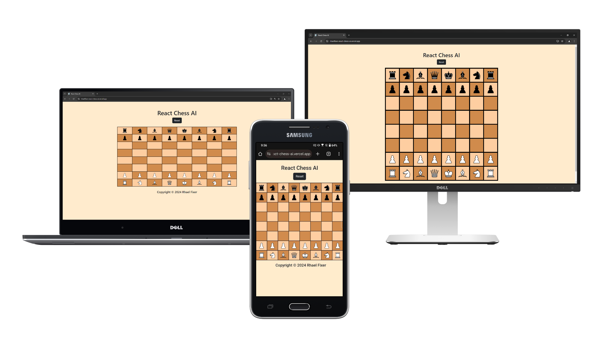

<div align="center">
  
</div>


# React Chess AI
## Introduction
My personal React Chess AI project. While it's not a multiplayer project, it offers an exciting gaming experience where players can play against an AI that utilizes the MiniMax Algorithm with Alpha-Beta pruning to improve efficiency.


## Key Features
- **Reset Game:** Reset the current match.
- **MiniMax Algorithm:** Implemented using the MiniMax Algorithm with Alpha-Beta pruning to improve efficiency.
- **Responsive Design:** Play the game seamlessly across various devices.


## Usage
Install Dependencies:
```
npm install
```
<br>

For Client Development:
```
npm start
```
<br>

For Build web app scripts and styles:
```
npm run build
```
<br>

For Client Production:
```
serve -s build
```


## Copyright
Copyright © 2023 **Rhael Fixer**. All rights reserved.


## License
This project is licensed under the [MIT License](LICENSE).
